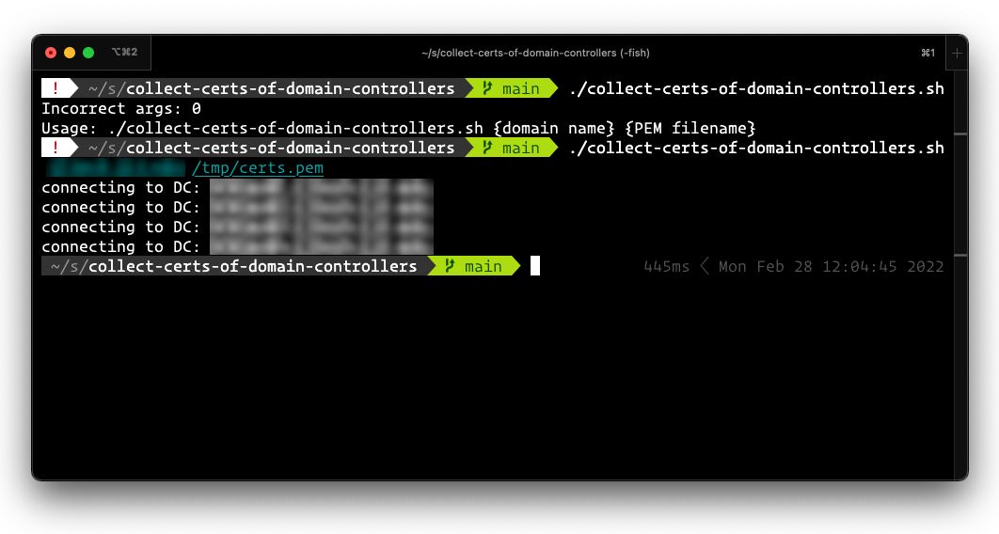

# collect-certs-of-domain-controllers

A simple shell script which collects the certs of an AD domain's domain controllers and writes them to a PEM output file.

## Requires

* `openssl`
* `nslookup`

##  Assumptions

* DCs are accessible and listening on the LDAPS port 636.

## Usage

Script requires two arguments:

1. the domain name of the AD domain
2. the path to the output file

The output file will be created if it doesn't already exists and will be appended to if it does exist.

**Example**:
```
$ collect-certs-of-domain-controllers.sh mydomain.com /tmp/certs.pem
```

